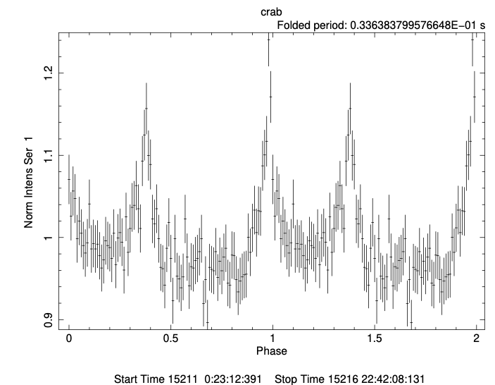

# MAXI GSC pulsar timing analysis 

## References
- MAXI data analysis https://darts.isas.jaxa.jp/missions/maxi/analysis/dataanalysis.html
- NICER timing analysis https://heasarc.gsfc.nasa.gov/docs/nicer/analysis_threads/bary_corr_phase_resolved_spectra/


## Test environment 
- Heasoft Ver.6.35(.2)
- CALDB

There is a bug in HEASoft Ver.6.35 maxi ftools
- [How to fix error in Heasoft Ver.6.35 (in my Mac, Apple M3 Sequoia 15.5).](error_in_headas635.md)

  

## Step by step procedure
Using Crab pulsar data

### 1. Download data 
```
% mxdownload_wget --coordinates 83.633083,22.0145\
  -date_from 2010-01-01 -date_to 2010-01-10\
  -uri https://darts.isas.jaxa.jp/pub/maxi/mxdata/
...
```

### 2. Run standard analysis script mxproduct 
Use `mxproduct` in HEASOFT 
```
% mxproduct 83.633083 22.014500 2010-01-01 2010-01-10 object=crab
...
```

#### 2.1 Check Image
```
% ds9 -scale log -zoom 2 -grid on products/crab_g_low.evt
... 
```

<!--  -->

#### 2.2 Check light curve
Using python script [plot_lc.py](plot_lc.py), 
``` 
% python -i plot_lc.py
>>>
```


#### 2.3 Check spectrum
```
% xspec
XSPEC12>data products/crab_g_low_src.pi 
XSPEC12>setplot ene
XSPEC12>ignore 1-**
XSPEC12>notice 2.0-20.
XSPEC12>model tbabs*power
XSPEC12>statistic cstat
XSPEC12>fit
XSPEC12>setplot rebin 3 10
XSPEC12>plot lda del
...
```


### 3. Pulsar timing analysis 
#### 3.0 Create orbit file
Merge daily orbit files into a single file using a python script [`merge_orbfile.py`](merge_orbfile.py)
```
% ./merge_orbfile.py -o orbit.fits --date_from 2009-12-31 --date_to 2010-01-12
...
```
Add a small margin on `date_from` and `date_to`.
Check `orbit.fits` has been successfully created.

#### 3.1 Barycentric time correction 
Sort events with time and perform barycentric time correction using `barycen`
```
% ftsort products/crab_g_low.evt crab_g_low_tsort.evt TIME
...

% barycen crab_g_low_tsort.evt crab_g_low_barycen.evt\
  orbit.fits\
  83.633083 22.0145\
  orbext="ORBIT" orbform=COMPONENTS orbcol="X,Y,Z,vX,vY,vZ"
...
```

#### 3.2 Epoch-folding search and Folded pulse profile
Get Crab pulsar ephemeris from the Jodrell Back Observatory data archive
https://www.jb.man.ac.uk/pulsar/crab/crab2.txt

The closest reference time for the data from 2010-01-01 (MJD 55197) is 

| Date | MJD | t_JPL (s) | $\nu$ (Hz) | $\dot{\nu}$ (e-15 Hz/s) |
|---|---|---|---|---|
|15 DEC 09| 55180 | 0.011470 | 29.7289425105| -371435.80|

| $P = 1/\nu$ (s) | $\dot{P} = -\dot{\nu}/\nu^2$ (s/s) |
|---|---|
|0.03363725432368840 | 4.202665622939618e-13 |


```
% efsearch cfile1="crab_g_low_barycen.evt" window="-"\
  sepoch="15180 0.011470"\
  dper=3.363725432368840e-02 dpdot=4.202665622939618e-13\ 
  nphase=16 nbint=INDEF dres=1e-10 nper=128
...
```


```
% efold nser=1 cfile1="crab_g_low_barycen.evt" window="-"\
  sepoch="15180 0.011470"\
  dper=3.363725432368840e-02 dpdot=4.202665622939618e-13\
  nphase=64 nbint=INDEF nintfm=INDEF
...
```


### 3.3 Phase-resolved event selection

```
% ftcalc infile='crab_g_low_barycen.evt[events]' \
  outfile=crab_g_low_baryref.evt \
  column=BARY_REF_TIME \
  expression='(TIME-(314150402.0+0.011470))' 
...
```
Add PHASE column expressed as 
$` \mathrm{PHASE} = \nu T + \dot{\nu} T^2/2 `$,
where $T=$ BARY_REF_TIME.
```
% ftcalc infile='crab_g_low_baryref.evt[events]' \
  outfile='crab_g_low_baryref_phase.evt' \
  column=PHASE \
  expression='(29.7289425105*(BARY_REF_TIME)+(-371435.80e-15*(BARY_REF_TIME**2)/2))%1'
...

```

Plot PHASE histogram
```
% fv crab_g_low_baryref_phase.evt
```


## Appendix

### A.1 Folded pulse profile at the Jodrell Bank Pulsar ephemeris data day 
Use MAXI GSC data from 2010-01-15 to 2010-01-20

Crab Pulsar ephemeris
| Date | MJD | t_JPL (s) | $\nu$ (Hz) | $\dot{\nu}$ (e-15 Hz/s) |
|---|---|---|---|---|
|15 JAN 10| 55211 | 0.000187 | 29.7279476972  | -371401.32|

| $P = 1/\nu$ (s) | $\dot{P} = -\dot{\nu}/\nu^2$ (s/s) |
|---|---|
|0.03363837995766480 | 4.202556747674502e-13 |

```
% efold nser=1 cfile1="crab_g_low_barycen.evt" window="-"\
  sepoch="15211 0.000187"\
  dper=3.363837995766480e-02 dpdot=4.202556747674502e-13\
  nphase=100 nbint=INDEF nintfm=INDEF
```


